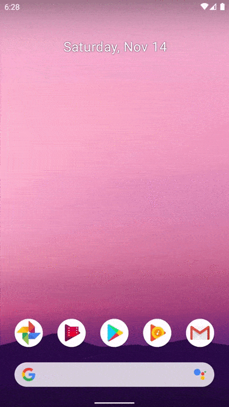

Dart is the programming language for Flutter, Google's UI toolkit for building beautiful, natively compiled mobile, web, and desktop apps from a single codebase.

## About Unit Converter

This repository has an application to carry out unit conversions. Where you can make conversions according to what you require.

## What you will need

[SDK](https://dart.dev/get-dart), a Software Development Kit of Flutter that gives us the necessary tools to develop multiplatform applications. In addition to using an IDE like [Android Studio](https://developer.android.com/studio/), [IntelliJ IDEA](https://www.jetbrains.com/idea/) with the Dart plugin or  [Visual Studio Code](https://code.visualstudio.com/) with the Dart Code extension.
